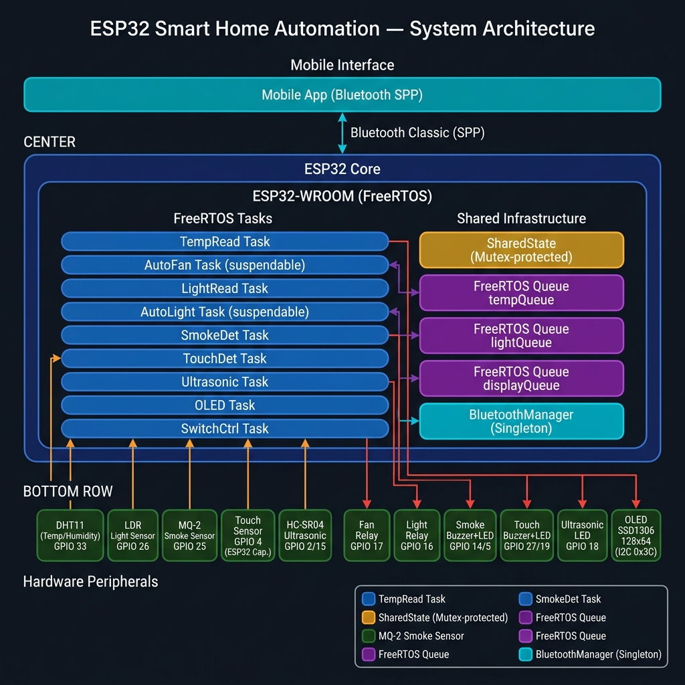

<div align="center">


# 🏠 ESP32 Smart Home Automation

**Multi-sensor home automation firmware — temperature, light, smoke, touch & presence monitoring with relay control and a live OLED dashboard.**  
Built on ESP32-WROOM, FreeRTOS, and Bluetooth Classic SPP. Fully local — no cloud dependency.

[📖 Wiki Documentation](https://github.com/aaabdelaziz/IOT_HomeAutomation/wiki) · [🐛 Report Bug](../../issues) · [✨ Request Feature](../../issues) · [🚀 Releases](../../releases)

</div>

---

## What is this?

This is a modular, object-oriented C++ firmware for the ESP32 that turns it into a full home automation hub. Each sensor and actuator runs as an **independent FreeRTOS task**, communicating through thread-safe queues and a mutex-protected shared state. A paired mobile app sends Bluetooth SPP commands to switch between **automatic mode** (sensor-driven) and **manual mode** (app-driven).

### Key capabilities

- 🌡️ **Temperature monitoring** — DHT11 triggers the fan relay automatically above threshold
- 💡 **Ambient light sensing** — LDR turns the bulb relay on in the dark automatically
- 🔥 **Smoke / gas detection** — MQ-2 fires buzzer + LED alert, notifies the app
- 👆 **Touch / intrusion sensing** — ESP32 capacitive touch triggers a security buzzer + LED
- 📡 **Ultrasonic presence detection** — HC-SR04 lights a presence LED when an object is close
- 📺 **OLED live dashboard** — SSD1306 128×64 shows temperature + five status icons
- 📱 **Bluetooth SPP control** — switch Auto/Manual/Off mode and control relays from a phone

---

## System Architecture



---

## Hardware

### Sensors

| Sensor | Component | GPIO | Notes |
|---|---|---|---|
| Temperature & Humidity | DHT11 | GPIO 33 | 2-second polling |
| Ambient Light | LDR (analogue) | GPIO 26 | ADC input |
| Smoke / Gas | MQ-2 (analogue) | GPIO 25 | ADC input |
| Touch / Intrusion | ESP32 Cap. Touch | GPIO 4 (T0) | Threshold: < 20 counts |
| Ultrasonic Presence | HC-SR04 | Trig: GPIO 15 / Echo: GPIO 2 | Presence threshold: 20 cm |

### Actuators & Outputs

| Actuator / Output | GPIO | Notes |
|---|---|---|
| Fan relay | GPIO 17 | Active-high relay |
| Light (bulb) relay | GPIO 16 | Active-high relay |
| Smoke buzzer | GPIO 14 | Fires when MQ-2 ADC > 3200 |
| Smoke alert LED | GPIO 5 | Mirrors smoke buzzer |
| Touch/intrusion buzzer | GPIO 27 | Fires on touch detection |
| Touch alert LED | GPIO 19 | Mirrors touch buzzer |
| Ultrasonic presence LED | GPIO 18 | On when object within range |
| OLED SSD1306 128×64 | I²C — 0x3C | Shows temp + 5 status icons |

> ⚠️ **Safety Warning:** Fan and light relays may switch mains voltage (110 V / 230 V AC). Work with AC circuits only if you are qualified. Always disconnect power before wiring.

---

## FreeRTOS Task Map

| Task name | Class | Stack | Mode | Description |
|---|---|---|---|---|
| `TempRead` | `TemperatureSensor` | 4 096 | Always | Reads DHT11 every 2 s; pushes to `tempQueue` & `displayQueue` |
| `AutoFan` | `FanController` | 4 096 | **Suspendable** | Reads `tempQueue`; energises fan relay above 33 °C |
| `LightRead` | `LightSensor` | 4 096 | Always | Reads LDR every 2 s; pushes to `lightQueue` |
| `AutoLight` | `LightController` | 4 096 | **Suspendable** | Reads `lightQueue`; energises bulb relay below ADC 2200 |
| `SmokeDet` | `SmokeSensor` | 4 096 | Always | Reads MQ-2 every 1 s; fires buzzer+LED+BT alert |
| `TouchDet` | `TouchSensor` | 4 096 | Always | Polls cap. touch; fires buzzer+LED+BT alert |
| `Ultrasonic` | `UltrasonicSensor` | 4 096 | Always | Pulses HC-SR04; lights presence LED; BT alert |
| `OLED` | `OLEDDisplay` | 8 192 | Always | Refreshes 128×64 dashboard at 5 Hz |
| `SwitchCtrl` | `SwitchController` | 4 096 | Always | Parses BT SPP commands; manages auto-task suspend/resume |

> **Default mode at boot:** `AutoFan` and `AutoLight` are suspended — system starts in **Manual mode**.

---

## Bluetooth SPP Protocol

All messages from the ESP32 end with the `?` delimiter so the app parser can split the stream.

### ESP32 → Mobile App

| Message | Meaning |
|---|---|
| `#<value>?` | Temperature reading in °C |
| `Fan on?` / `Fan off?` | Fan relay state changed |
| `Bulb on?` / `Bulb off?` | Light relay state changed |
| `Smoke active?` / `Smoke inactive?` | Smoke/gas alarm state |
| `Touch active?` / `Touch inactive?` | Intrusion alarm state |
| `Ultrasonic active?` / `Ultrasonic inactive?` | Presence detection state |

### Mobile App → ESP32

| Command char | Effect |
|---|---|
| `A` | **Automatic mode** — resume AutoFan + AutoLight tasks |
| `M` | **Manual mode** — suspend AutoFan + AutoLight tasks |
| `O` | **Off mode** — suspend auto tasks, turn both relays off |
| `F` | Fan ON (manual) |
| `Y` | Fan OFF (manual) |
| `L` | Light ON (manual) |
| `Z` | Light OFF (manual) |
| `T` | Clear touch alarm |

---

## Shared State & Thread Safety

All tasks read/write sensor values through `SharedState` — a mutex-protected singleton:

```cpp
// Writer (sensor task)
SharedState::update([](SystemState& s){ s.temperature = 27; });

// Reader (OLED / BT task)
SystemState snap = SharedState::snapshot();
```

The `SystemState` struct holds:

| Field | Type | Description |
|---|---|---|
| `fanActive` | `bool` | Fan relay energised |
| `lightActive` | `bool` | Bulb relay energised |
| `smokeDetected` | `bool` | MQ-2 threshold exceeded |
| `touchDetected` | `bool` | Capacitive touch active |
| `presenceDetected` | `bool` | Object within ultrasonic range |
| `temperature` | `int` | Latest DHT11 reading (°C) |
| `lightLevel` | `int` | Latest LDR ADC reading |
| `smokeLevel` | `int` | Latest MQ-2 ADC reading |
| `distanceCm` | `int` | Latest ultrasonic reading (cm) |

---

## Repository Structure

```
IOT_HomeAutomation/                   ← repo root
├── firmware/                         ← ESP32 PlatformIO project
│   ├── lib/                          # Per-component libraries (auto-discovered)
│   │   ├── TemperatureSensor/        # DHT11 driver
│   │   │   ├── TemperatureSensor.h
│   │   │   └── TemperatureSensor.cpp
│   │   ├── FanController/            # Fan relay (auto + manual)
│   │   │   ├── FanController.h
│   │   │   └── FanController.cpp
│   │   ├── LightSensor/              # LDR driver
│   │   │   ├── LightSensor.h
│   │   │   └── LightSensor.cpp
│   │   ├── LightController/          # Bulb relay (auto + manual)
│   │   │   ├── LightController.h
│   │   │   └── LightController.cpp
│   │   ├── SmokeSensor/              # MQ-2 driver + alert outputs
│   │   │   ├── SmokeSensor.h
│   │   │   └── SmokeSensor.cpp
│   │   ├── TouchSensor/              # Capacitive touch + alert outputs
│   │   │   ├── TouchSensor.h
│   │   │   └── TouchSensor.cpp
│   │   ├── UltrasonicSensor/         # HC-SR04 driver + presence LED
│   │   │   ├── UltrasonicSensor.h
│   │   │   └── UltrasonicSensor.cpp
│   │   ├── OLEDDisplay/              # SSD1306 dashboard + icon bitmaps
│   │   │   ├── OLEDDisplay.h
│   │   │   ├── OLEDDisplay.cpp
│   │   │   └── Icons.h
│   │   ├── BluetoothManager/         # Classic BT SPP singleton
│   │   │   ├── BluetoothManager.h
│   │   │   └── BluetoothManager.cpp
│   │   └── SwitchController/         # BT command parser & mode switcher
│   │       ├── SwitchController.h
│   │       └── SwitchController.cpp
│   ├── src/                          # Application entry point
│   │   ├── main.cpp                  # setup() / loop() — bootstrap & tasks
│   │   └── SystemState.cpp           # SharedState static definitions
│   ├── include/                      # Shared / cross-cutting headers
│   │   ├── Config.h                  # All GPIO pins, thresholds, stack sizes
│   │   └── SystemState.h             # Thread-safe shared state singleton
│   ├── imags/                        # Architecture diagrams & images
│   ├── platformio.ini                # PlatformIO build configuration
│   └── ImageDrawer.py                # Helper script for OLED bitmap generation
├── mobile/                           ← future mobile companion app
│   └── README.md                     # BT protocol docs + planned Flutter stack
├── README.md                         ← project overview (this file)
└── LICENSE
```

---

## Quick Start

### Flash with PlatformIO

```bash
git clone https://github.com/aaabdelaziz/IOT_HomeAutomation.git
cd IOT_HomeAutomation/firmware
pio run --target upload
pio device monitor --baud 115200
```

### Pair the mobile app

1. Power on the ESP32 — it advertises as **`SmartHome-ESP32`** over Bluetooth Classic.
2. Pair from your phone's Bluetooth settings.
3. Open a Bluetooth SPP terminal app and connect.
4. Send `A` to enable automatic mode or `M` for manual mode.

---

## Tech Stack

| Layer | Technology |
|---|---|
| Microcontroller | ESP32-WROOM (Espressif) |
| RTOS | FreeRTOS (built into Arduino-ESP32) |
| Firmware language | C++17 · Arduino framework |
| Build system | PlatformIO |
| Wireless | Bluetooth Classic SPP (`BluetoothSerial`) |
| Temperature sensor | DHT11 (DHT library) |
| Display | SSD1306 OLED — Adafruit GFX + SSD1306 |
| Inter-task comms | FreeRTOS Queues + Mutex-protected SharedState |

---

## Features

| Feature | Status |
|---|---|
| DHT11 temperature monitoring → fan auto-control | ✅ Ready |
| LDR light sensing → bulb auto-control | ✅ Ready |
| MQ-2 smoke/gas detection + buzzer & LED alert | ✅ Ready |
| ESP32 capacitive touch intrusion detection + alert | ✅ Ready |
| HC-SR04 ultrasonic presence detection + LED | ✅ Ready |
| SSD1306 128×64 OLED live dashboard | ✅ Ready |
| Bluetooth Classic SPP command interface | ✅ Ready |
| Auto / Manual / Off mode switching | ✅ Ready |
| Thread-safe SharedState via FreeRTOS mutex | ✅ Ready |
| OTA firmware updates | 📋 Planned |

---

## Documentation

Full project documentation is available in the **[Project Wiki](docs/wiki/Home.md)**, including:
- [System Architecture](docs/wiki/System-Architecture.md)
- [Hardware Wiring Guide](docs/wiki/Hardware-Wiring.md)
- [Communication Protocols (Bluetooth SPP)](docs/wiki/Communication-Protocols.md)

---

## License

MIT © 2026 — Ahmed Abdelaziz. See [LICENSE](LICENSE) for details.

---

<div align="center">

Made with ☕ and a lot of soldering

</div>
