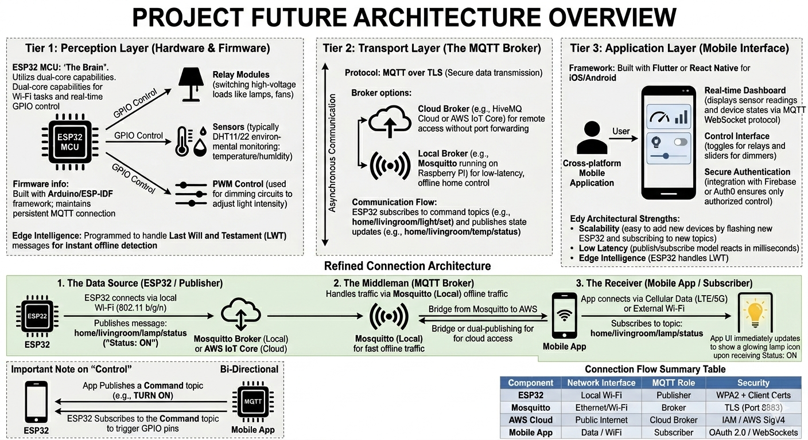

<div align="center">


# 💡 SmartHome Lamp Controller

**Open-source IoT home automation — control every lamp in your home from your phone.**  
Built on ESP32, Flutter, and MQTT. Works locally, works remotely, works offline.

[📖 Wiki](../../wiki) · [🐛 Report Bug](../../issues) · [✨ Request Feature](../../issues) · [🚀 Releases](../../releases)

</div>

---

## What is this?

SmartHome Lamp Controller lets you control the lights in your home using a **mobile app** (iOS & Android) and **ESP32 microcontrollers** wired to your lamp circuits. Everything communicates over **MQTT** — a lightweight protocol designed for embedded devices.

- Turn lamps on/off individually or by room
- Dim lights with PWM brightness control
- Schedule automations (wake-up light, bedtime routine)
- Works **fully local** — no cloud required
- Optional **remote access** via encrypted cloud broker
- Compatible with **Home Assistant**

---

## System Architecture



---

## Features

| Feature                            | Status         |
| ---------------------------------- | -------------- |
| On/Off relay control               | ✅ Ready       |
| Brightness dimming (PWM)           | 📋 Planned     |
| Flutter mobile app (iOS + Android) | 🔄 In progress |
| Local MQTT broker (Mosquitto)      | ✅ Ready       |
| mDNS auto-discovery (no IP setup)  | 📋 Planned     |
| OTA firmware updates               | 📋 Planned     |
| BLE provisioning (Wi-Fi setup)     | 📋 Planned     |
| Scheduling & automations           | 📋 Planned     |
| Home Assistant integration         | 📋 Planned     |
| Matter / Thread support            | 📋 Planned     |

---

## Hardware Requirements

| Component         | Example                  | Notes                |
| ----------------- | ------------------------ | -------------------- |
| Microcontroller   | ESP32-DevKitC            | Wi-Fi + BLE built-in |
| Relay module      | 4-channel 5V relay board | Switches mains lamps |
| Dimmer (optional) | RobotDyn AC Dimmer       | PWM brightness       |
| Power supply      | HLK-PM01 5V/3W           | Mains → 3.3V         |
| Status LED        | WS2812B NeoPixel         | Visual feedback      |

> ⚠️ **Safety Warning:** This project involves mains voltage (110V/230V AC). Work with AC circuits only if you are qualified. Always disconnect power before wiring.

---

## Quick Start

### 1 — Flash the ESP32

```bash
git clone https://github.com/your-org/iot-home-automation.git
cd iot-home-automation/firmware
```

Copy the example config and fill in your details:

```bash
cp include/config.example.h include/config.h
```

Edit `config.h`:

```cpp
#define WIFI_SSID      "YourNetworkName"
#define WIFI_PASSWORD  "YourPassword"
#define MQTT_HOST      "192.168.1.100"   // Your broker IP
#define MQTT_PORT      8883
#define MQTT_USER      "lamp_001"
#define MQTT_PASS      "your_device_password"
#define DEVICE_ID      "lamp_001"
#define ROOM           "living_room"
```

Flash with PlatformIO:

```bash
pio run --target upload
```

Or open in Arduino IDE and click **Upload**.

---

### 2 — Start the MQTT Broker

**With Docker (easiest):**

```bash
cd broker
docker compose up -d
```

**Manually on Raspberry Pi / Linux:**

```bash
sudo apt install -y mosquitto mosquitto-clients
sudo systemctl enable --now mosquitto
```

Test it works:

```bash
mosquitto_sub -h localhost -t "home/#" -v
```

---

### 3 — Run the Mobile App

Requirements: [Flutter SDK 3.x](https://flutter.dev/docs/get-started/install)

```bash
cd mobile
flutter pub get
flutter run
```

The app auto-discovers your broker on the local network via mDNS. No IP address needed.

---

## MQTT Topic Structure

```
home/{room}/{device_id}/command    →  App sends commands to ESP32
home/{room}/{device_id}/state      →  ESP32 reports current state
home/{room}/{device_id}/status     →  ESP32 online/offline (LWT)
```

**Command payload (App → ESP32):**

```json
{ "action": "set", "state": "ON", "brightness": 75 }
```

**State payload (ESP32 → App):**

```json
{ "state": "ON", "brightness": 75, "uptime": 3600, "rssi": -58 }
```

---

## Repository Structure

```
iot-home-automation/
├── firmware/          # ESP32 C++ source (Arduino / PlatformIO)
│   ├── src/
│   └── include/
├── mobile/            # Flutter app (iOS + Android)
│   └── lib/
├── broker/            # Mosquitto config + Docker Compose
└── docs/              # Extra docs, wiring diagrams
```

---

## Tech Stack

| Layer                | Technology                                |
| -------------------- | ----------------------------------------- |
| Embedded firmware    | C++ · Arduino framework · PlatformIO      |
| Microcontroller      | ESP32 (Espressif)                         |
| Primary protocol     | MQTT over TLS (Mosquitto / EMQX / HiveMQ) |
| Local discovery      | mDNS / DNS-SD                             |
| Initial provisioning | BLE (Bluetooth Low Energy)                |
| Firmware updates     | HTTP OTA                                  |
| Mobile app           | Flutter 3 · Dart                          |
| MQTT client (mobile) | `mqtt_client` package                     |

---

## Security

- TLS encryption on all MQTT traffic (port 8883)
- Username/password auth per device
- Per-device topic ACLs (devices can only publish their own state)
- Wi-Fi credentials stored in ESP32 NVS (not compiled into firmware)
- BLE pairing for initial provisioning only

See [Security Guide](docs/security.md) for full setup instructions.

---

## Documentation

Full documentation lives in the [project Wiki](../../wiki):

- [System Architecture](../../wiki#2-system-architecture)
- [Hardware Wiring Guide](../../wiki#3-hardware--esp32-embedded-controller)
- [Communication Protocols](../../wiki#4-communication-protocols)
- [Mobile App Guide](../../wiki#6-mobile-application)
- [Broker Setup](../../wiki#5-backend--broker-infrastructure)
- [Security Guide](../../wiki#7-security)

---

## Contributing

Contributions are very welcome! Please open an **issue** first to discuss what you'd like to change.

```bash
# Fork → clone → branch → PR
git checkout -b feature/my-feature
git commit -m "feat: add my feature"
git push origin feature/my-feature
```

See [CONTRIBUTING.md](CONTRIBUTING.md) for guidelines.

---

## License

MIT © 2026 — SmartHome Contributors. See [LICENSE](LICENSE) for details.

---

<div align="center">

Made with ☕ and a lot of soldering

</div>
