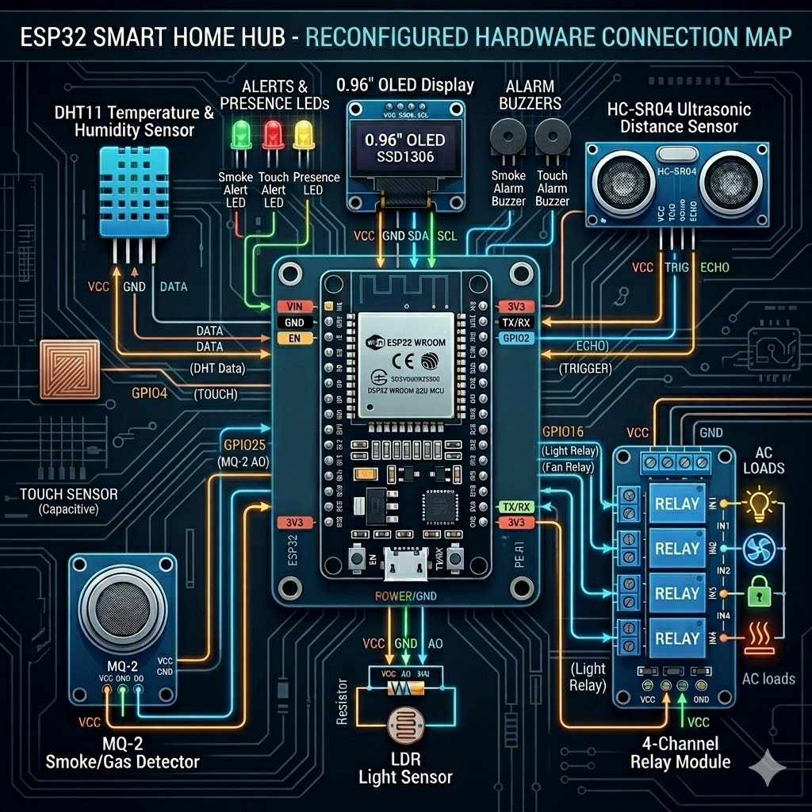

# Hardware Wiring Guide

This document maps all the physical connections required between the ESP32 and the various sensors and actuators used in the Smart Home Automation project.

> [!IMPORTANT]
> All pin assignments are centrally defined in the codebase in `firmware/include/Config.h`. If you change the wiring on your physical breadboard/PCB, you only need to update that single file.

## 1. Sensors

| Sensor Type | Component | ESP32 GPIO Pin | Signal Type | Notes |
| :--- | :--- | :--- | :--- | :--- |
| **Temperature & Humidity** | DHT11 | **GPIO 33** | Digital (1-wire protocol) | Requires a 10k pull-up resistor if your module doesn't include one. Polled every 2s. |
| **Ambient Light** | LDR Photoresistor | **GPIO 26** | Analogue (ADC) | Wire as a voltage divider with a 10k resistor. High ADC = Dark. |
| **Smoke / Gas** | MQ-2 | **GPIO 25** | Analogue (ADC) | Requires ~5V for the heater coil. High ADC = Gas detected. |
| **Touch / Intrusion** | Capacitive Touch | **GPIO 4 (T0)** | Internal Cap-Touch | Connect a wire or copper foil to the pin. Threshold < 20 counts triggers alert. |
| **Ultrasonic Presence** | HC-SR04 | **Trig: 15 / Echo: 2** | Digital (Pulse timing) | Echo pin requires a voltage divider (5V to 3.3V) to safely connect to ESP32. |

## 2. Actuators & Outputs

| Component | ESP32 GPIO Pin | Type | Notes |
| :--- | :--- | :--- | :--- |
| **Fan Relay** | **GPIO 17** | Digital Out | Active-high. Connect to base of NPN transistor or relay module IN pin. |
| **Light Bulb Relay** | **GPIO 16** | Digital Out | Active-high. |
| **Smoke Alarm Buzzer** | **GPIO 14** | Digital Out | Active-high. Sounds when MQ-2 threshold > 3200. |
| **Smoke Alert LED** | **GPIO 5** | Digital Out | Active-high. Requires 220Ω series resistor. |
| **Touch Alarm Buzzer** | **GPIO 27** | Digital Out | Active-high. Sounds on capacitive touch detection. |
| **Touch Alert LED** | **GPIO 19** | Digital Out | Active-high. Requires 220Ω series resistor. |
| **Presence LED** | **GPIO 18** | Digital Out | Active-high. Lights up when HC-SR04 detects object < 20cm. |

## 3. I²C Display

| Component | ESP32 Pin | Function | Notes |
| :--- | :--- | :--- | :--- |
| **OLED 128x64** | **GPIO 21** | SDA (Data) | I²C Address is `0x3C`. Requires 3.3V power. |
| **OLED 128x64** | **GPIO 22** | SCL (Clock) | Standard ESP32 hardware I²C pins. |

---

> [!WARNING]
> **Mains Voltage Safety:** 
> The Fan Relay (GPIO 17) and Light Relay (GPIO 16) are intended to switch mains voltage (110V/230V AC) to operate real household appliances. 
> * Do not attempt to wire mains voltage unless you are qualified to do so.
> * Ensure your relay modules are appropriately rated (e.g., 10A 250VAC) and optically isolated.
> * Always disconnect mains power before working on the circuit.
